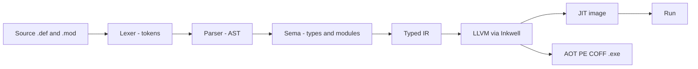

# The NewM2 Modula-2 — A User Guide

**Modula-2** is Niklaus Wirth's systems language: small, strongly typed, and built around
*modules* with separately compiled interfaces and bodies. **NewM2** is a from-scratch
Modula-2 compiler implementing **PIM 4 + ISO 10514-1** on a modern Rust + LLVM,
JIT-first architecture (with an AOT `.exe` build mode). It compiles a `.def`/`.mod` pair to
a memory-resident image you can run directly, or to a native PE/COFF executable.

This is the diagram-rich, browsable companion to NewM2's design notes. It documents
Modula-2 as NewM2 implements it; each page notes where a construct is live versus still
being wired. Browse it with `pwsh tools/doccrate/Browse-Docs.ps1`.

## Hello, Modula-2

```modula2
MODULE Hello;
IMPORT STextIO;
BEGIN
  STextIO.WriteString("Hello, NewM2!");
  STextIO.WriteLn;
END Hello.
```

A program is a `MODULE`. `IMPORT STextIO` brings in the ISO text-output module, used
*qualified* as `STextIO.WriteString`. The body runs between `BEGIN` and `END Hello.` — the
closing `END` names the module and ends with a period. Run it with `newm2 run Hello.mod`.

## From source to running code



Every phase has a `dump-*` command so you can inspect the pipeline — see
[Getting started](getting-started.md).

## What makes Modula-2 Modula-2

- **Modules with separate interface and body.** A library is a `DEFINITION MODULE` (what
  clients see) plus an `IMPLEMENTATION MODULE` (the code), compiled apart. See
  [Modules & compilation](modules-and-compilation.md).
- **Strong, static typing** with a compact set of built-in types and powerful structured
  types — records (with variants), sets, arrays, pointers. See
  [Declarations & types](declarations-and-types.md).
- **Case-sensitive**, with reserved words and standard identifiers in UPPER CASE.
- **Pervasive identifiers, not keywords.** `INTEGER`, `NEW`, `INC`, `TRUE`, `NIL`, … are
  predeclared *identifiers* you can (but shouldn't) redeclare — they are not reserved words.

## Contents

| Page | What it covers |
|------|----------------|
| [Getting started](getting-started.md) | Build, run, the `dump-*` driver, the `.def`/`.mod` model |
| [Lexical structure](lexical-structure.md) | Comments, identifiers, reserved words, literals, pragmas |
| [Modules & compilation](modules-and-compilation.md) | `DEFINITION`/`IMPLEMENTATION`, `IMPORT`/`EXPORT`, opaque types |
| [Declarations & types](declarations-and-types.md) | `CONST`/`TYPE`/`VAR`, the type system |
| [Expressions & operators](expressions-and-operators.md) | Arithmetic, `DIV`/`MOD`/`REM`, sets, precedence |
| [Statements & control flow](statements-and-control-flow.md) | `IF`, `CASE`, `WHILE`, `REPEAT`, `FOR`, `LOOP`, `WITH` |
| [Procedures](procedures.md) | Value/`VAR` parameters, function procedures, nesting, procedure types |
| [The standard environment](standard-environment.md) | Pervasive procedures, the `SYSTEM` module, key libraries |
| [Memory & exceptions](memory-and-exceptions.md) | Pointers, `NEW`/`DISPOSE`, manual memory, `EXCEPT`/`FINALLY` |
| [Reference](reference.md) | Reserved words and pervasive identifiers |

## Conventions

- Code is Modula-2 (`.mod`/`.def`) unless noted; examples are small and runnable.
- A `src/newm2-…/…rs:NN` reference points into the NewM2 compiler source.
- Comments are `(* … *)` and nest. Statements are separated by `;`. Assignment is `:=`.

---
*Authoring: see `tools/doccrate/AUTHORING.md`. Render a page with
`tools/doccrate/Test-Render.ps1`.*
