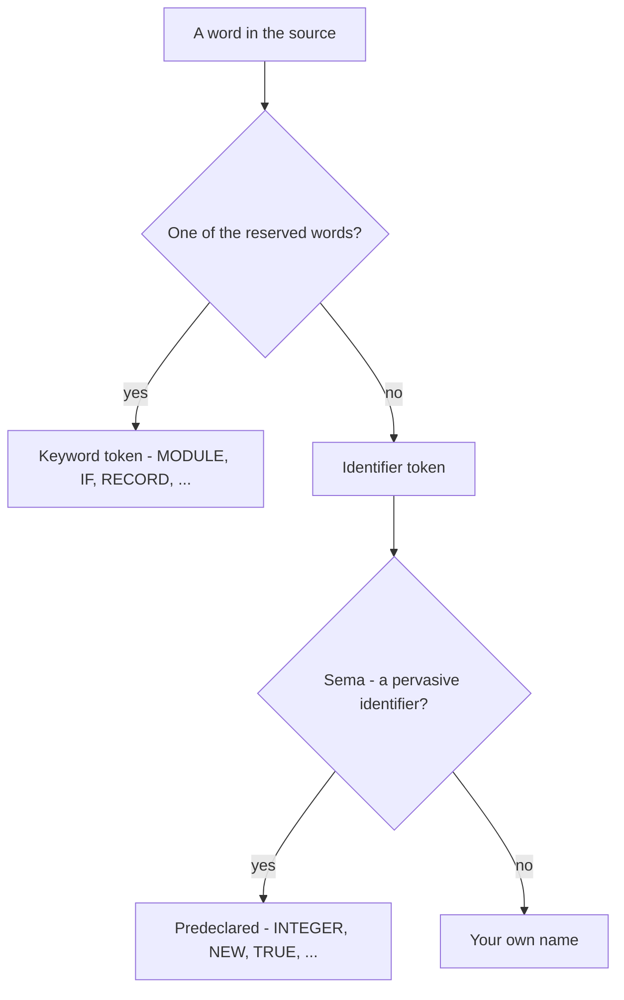

# Lexical Structure

How NewM2's lexer turns source text into tokens: comments, case-sensitive identifiers, the
reserved-word set, and the literal forms. A defining Modula-2 trait shows up here — the
built-in type and procedure names are *identifiers*, not keywords.

## Comments and case

Comments are delimited by `(*` and `*)` and **nest**, so you can comment out a region that
already contains a comment:

```modula2
(* outer (* inner *) still open here *)
```

Modula-2 is **case-sensitive**, and reserved words and standard identifiers are spelled in
**UPPER CASE**. `Count`, `count`, and `COUNT` are three different identifiers; `BEGIN` is a
keyword but `Begin` is an ordinary identifier.

## Identifiers and reserved words

An identifier is a letter followed by letters and digits. The lexer reserves the words
below (`src/newm2-lexer/src/token.rs`) — the PIM 4 core, the ISO 10514-1 additions, a
piece of the ISO 10514-2 object extension, and NewM2 extensions:

| Group | Reserved words |
|-------|----------------|
| Modules & structure | `MODULE` `DEFINITION` `IMPLEMENTATION` `IMPORT` `FROM` `EXPORT` `QUALIFIED` `BEGIN` `END` |
| Declarations | `CONST` `TYPE` `VAR` `PROCEDURE` `FORWARD` `RECORD` `ARRAY` `SET` `POINTER` `OF` `TO` |
| Control flow | `IF` `THEN` `ELSIF` `ELSE` `CASE` `WHILE` `DO` `REPEAT` `UNTIL` `FOR` `BY` `LOOP` `EXIT` `WITH` `RETURN` |
| Operators (word) | `AND` `OR` `NOT` `DIV` `MOD` `REM` `IN` |
| ISO 10514-1 | `EXCEPT` `FINALLY` `RETRY` `GENERIC` `PACKEDSET` |
| ISO 10514-2 (parsed, deferred) | `ABSTRACT` |
| NewM2 extensions | `ASM` `BAND` `BOR` `BXOR` `BNOT` `SHL` `SHR` |

## Pervasive identifiers — *not* keywords

This is the part newcomers miss. The built-in **types** (`INTEGER`, `CARDINAL`, `REAL`,
`CHAR`, `BOOLEAN`, `BITSET`, …), the standard **procedures** (`NEW`, `DISPOSE`, `INC`,
`DEC`, `INCL`, `EXCL`, `HIGH`, `SIZE`, `ORD`, `CHR`, `VAL`, `MIN`, `MAX`, `ABS`, `CAP`, …),
and the constants (`TRUE`, `FALSE`, `NIL`) are **pervasive identifiers** — predeclared in
an enclosing pseudo-scope, *not* reserved words. The lexer returns them as ordinary
`Ident` tokens; sema resolves them.



Because they are not reserved, you *could* declare a local `INTEGER` — Modula-2 lets you,
and it shadows the pervasive one. (Don't.)

## Literals

```modula2
CONST
  dec  = 1995;        (* decimal integer *)
  oct  = 777B;        (* octal integer, B suffix *)
  hex  = 0FFH;        (* hex integer, H suffix, leading digit *)
  pi   = 3.14159;     (* REAL — needs a digit each side of the point *)
  big  = 6.022E23;    (* REAL with exponent *)
  ch   = "A";         (* character or one-char string *)
  nl   = 12C;         (* character by octal ordinal, C suffix *)
  msg  = "hello";     (* string literal *)
```

Strings may use double or single quotes (`"hi"` or `'hi'`); the other quote may appear
inside unescaped. NewM2 carries `A`/`U` literal flavours on character and string
literals (narrow/wide), and **pragmas** are written `<* … *>`
(`src/newm2-lexer/src/token.rs`).

---
[NewM2 Guide home](index.md) · [Declarations & types](declarations-and-types.md) · [Expressions & operators](expressions-and-operators.md)
