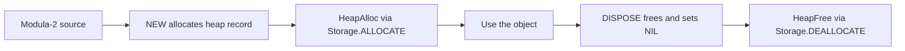

# Memory & Exceptions

How NewM2 allocates heap objects, reclaims them, and handles runtime exceptions — two
topics that share a common thread: what happens when things go wrong at runtime.

## Pointers

`POINTER TO T` is a heap pointer type. A variable of pointer type holds either a heap
address or the null value `NIL`. `NIL` is assignment-compatible with every pointer type.

```modula2
TYPE
  Node    = RECORD
    value  : INTEGER;
    serial : INTEGER;
  END;
  NodePtr = POINTER TO Node;

VAR p : NodePtr;
```

AST node: `TypeExpr::Pointer(Box<TypeExpr>, Span)` (`src/newm2-parser/src/ast.rs`, line 213).

**Dereferencing** uses the postfix `^` operator. `p^` yields the `Node` that `p` points
to. Fields are then accessed with `.`:

```modula2
p^.value  := 99;
p^.serial := p^.value * 2;
```

This exact pattern is in `Mod/tests/t-40-010-new-record.mod` — the test allocates a
`Node` record, writes both fields, and reads them back.

**Forward-declared pointers.** A `POINTER TO T` may appear in a `TYPE` section before
`T` is defined, as long as both appear in the same `TYPE` block. This is the standard
Modula-2 idiom for linked structures:

```modula2
TYPE
  ListPtr = POINTER TO List;   (* List not yet declared — OK *)
  List    = RECORD
    value : INTEGER;
    next  : ListPtr;
  END;
```

Sema defers resolution of the `Unresolved` pointer target until the full `TYPE` section
has been processed.

## NEW and DISPOSE

`NEW` and `DISPOSE` are pervasive procedures — predeclared identifiers, not reserved
words. The lexer returns them as ordinary `Ident` tokens; sema resolves them.

- **`NEW(p)`** allocates a heap record whose type is the base type of `p` and assigns the
  pointer. The payload is zero-initialised. The runtime entry point calls
  `Storage.ALLOCATE`, which maps to `HeapAlloc`.
- **`DISPOSE(p)`** frees the object and sets `p` to `NIL`. It calls `Storage.DEALLOCATE`,
  which maps to `HeapFree`. Every `NEW` must be paired with a `DISPOSE` before the
  pointer goes out of scope to avoid leaks.

A minimal working example (from `Mod/tests/t-40-010-new-record.mod`):

```modula2
MODULE T40010NewRecord;
IMPORT STextIO, SWholeIO;

TYPE
  Node    = RECORD value : INTEGER; serial : INTEGER; END;
  NodePtr = POINTER TO Node;

VAR p : NodePtr;

BEGIN
  NEW(p);
  p^.value  := 99;
  p^.serial := p^.value * 2;
  SWholeIO.WriteInt(p^.value, 0);
  STextIO.WriteLn;
  SWholeIO.WriteInt(p^.serial, 0);
  STextIO.WriteLn;
  DISPOSE(p);
END T40010NewRecord.
```

## Manual memory management

NewM2 uses classical manual memory: `Storage.ALLOCATE` maps to `HeapAlloc` and
`Storage.DEALLOCATE` maps to `HeapFree`. Every `NEW` allocation must be paired with a
`DISPOSE` before the pointer goes out of scope.



```modula2
VAR p : NodePtr;
BEGIN
  NEW(p);
  (* … use p … *)
  DISPOSE(p);    (* frees the block; p is set to NIL *)
END;
```

There is no collector, no safepoint overhead, and no conservative stack scan.

## Exceptions: EXCEPT, FINALLY, RETRY

ISO 10514-1 extends Modula-2's statement syntax with structured exception handling. The
exception mechanism wraps a body of statements in a *protected block* that can catch and
re-run on error. NewM2 **parses this syntax fully** (confirmed in
`src/newm2-parser/src/ast.rs`, lines 361–411) but **back-end execution of exception
handling is deferred** — RAISE compiles to `llvm.trap` and RETRY is a no-op in the
current lowering phase (`src/newm2-ir/src/lower.rs`, lines 772–779;
`src/newm2-llvm/src/codegen.rs`, line 1008).

Document the syntax and semantics now; they are what ISO programs will use once the
back-end wires up the EH landingpads (currently planned for Phase 8 per the lower.rs
comment at line 778).

### Protected block structure

Any module body or procedure body may have an `EXCEPT` part and/or a `FINALLY` part
appended before the closing `END`. The AST carries these as fields of `Block`:
`except: Vec<ExceptArm>` and `finally: Option<Vec<Stmt>>`
(`ast.rs`, lines 363–366).

```modula2
BEGIN
  (* protected body *)
  DoSomethingRisky;
  OpenFile(name, f);
EXCEPT
  FileNotFound : STextIO.WriteString("file not found"); |
  AccessDenied : STextIO.WriteString("access denied");
FINALLY
  CloseFile(f);
END;
```

- The `EXCEPT` part lists one or more *exception arms*. Each arm names one or more
  exception identifiers (`ExceptArm.names: Vec<QualName>`), followed by a colon and a
  statement sequence. Arms are separated by `|`.
- A bare `EXCEPT` with no names is a catch-all (an `ExceptArm` with an empty `names`
  vec). This catches any exception not matched by an earlier named arm.
- The `FINALLY` part is a statement sequence that runs whether or not an exception was
  raised — always executed on exit from the protected block, normal or exceptional. Use
  it for cleanup such as releasing resources.

### RAISE

`RAISE` raises an exception. It appears as `Stmt::Raise(Option<Expr>, Span)` in the
AST (`ast.rs`, line 407). With an expression it raises a specific exception value;
bare `RAISE` (inside an exception handler) re-raises the current exception:

```modula2
RAISE FileNotFound;    (* raise a specific exception *)
RAISE;                 (* re-raise; only inside an EXCEPT arm *)
```

**Current status:** the lowering phase emits `llvm.trap` for `RAISE`, so any module
that executes a `RAISE` statement will trap immediately. This is correct behaviour for
catching the case at test time; structured dispatch is Phase 8.

### RETRY

`RETRY` is a statement that re-runs the protected body from the beginning. It may only
appear inside an `EXCEPT` arm.

```modula2
VAR attempts : INTEGER;
BEGIN
  attempts := 0;
EXCEPT
  TransientError :
    INC(attempts);
    IF attempts < 3 THEN RETRY END;
END;
```

**Current status:** the lowering phase silently drops `RETRY` (`lower.rs`, line 777:
`"Phase 4: RETRY is a structural no-op; full EH in Phase 8"`). Code that depends on
re-execution will not retry in the current build; it will fall through as if `RETRY`
were an empty statement.

### Anonymous exception blocks

An `EXCEPT`/`FINALLY` block may appear as a statement in its own right — not only at
the end of a procedure body. The parser represents this as `Stmt::Block(Block)` where
the `Block` carries its own `except` and `finally` fields (`ast.rs`, lines 409–411).
Nesting is supported.

```modula2
PROCEDURE Transfer(src, dst : ARRAY OF CHAR);
BEGIN
  (* outer body *)
  BEGIN
    CopyFile(src, dst);
  EXCEPT
    IOError : HandleCopyError(src, dst);
  FINALLY
    ReleaseLock;
  END;
  (* outer body continues *)
END Transfer;
```

### Summary of exception status

| Construct | Parses | IR lowered | Back-end executes |
|-----------|--------|------------|-------------------|
| `EXCEPT` arms | Yes | Structural skeleton | Deferred Phase 8 |
| `FINALLY` block | Yes | Structural skeleton | Deferred Phase 8 |
| `RAISE expr` | Yes | Emits `llvm.trap` | Traps immediately |
| `RETRY` | Yes | No-op (dropped) | Silently skipped |

Write exception-guarded code today if you are building for the future; just be aware
that only `RAISE` produces observable behaviour (a trap), while `EXCEPT` handlers and
`RETRY` are not yet dispatched.

---
[NewM2 Guide home](index.md) · [Declarations & types](declarations-and-types.md) · [The standard environment](standard-environment.md)
