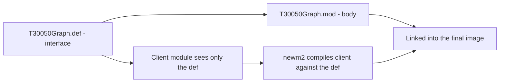

# Modules & Compilation

Modula-2's defining characteristic: a library is split into a *public interface* and a
*private body* that are compiled **separately**, so clients can never see — or depend on —
implementation details.

## Three kinds of module

Modula-2 has three distinct module kinds, reflected in the `ModuleKind` enum
(`src/newm2-parser/src/ast.rs:29`):

| Kind | Keyword | File | Purpose |
|------|---------|------|---------|
| Program | `MODULE` | `.mod` | Has a body; the entry point you run |
| Definition | `DEFINITION MODULE` | `.def` | Public interface — what clients see |
| Implementation | `IMPLEMENTATION MODULE` | `.mod` | The body — paired with a `.def` |

There is a fourth variant, `Local`, for modules nested inside procedures; see the
[Local modules](#local-modules) section below.

## DEFINITION and IMPLEMENTATION

A **DEFINITION MODULE** declares everything that the outside world may use: constants,
types, variables, and procedure *headers* (signature only, no body). A matching
**IMPLEMENTATION MODULE** supplies the procedure bodies, private types, and any
module-level initialisation code.

Here is the real pair from `Mod/tests/T30030ScalarHelper.def` and
`Mod/tests/T30030ScalarHelper.mod`:

**`T30030ScalarHelper.def` — the interface**

```modula2
DEFINITION MODULE T30030ScalarHelper;

CONST
  BaseInt = 11;
  BaseCard = 7;

PROCEDURE BumpInt(n : INTEGER) : INTEGER;
PROCEDURE BumpCard(n : CARDINAL) : CARDINAL;
PROCEDURE NextChar(ch : CHAR) : CHAR;
PROCEDURE Flip(flag : BOOLEAN) : BOOLEAN;

END T30030ScalarHelper.
```

**`T30030ScalarHelper.mod` — the body**

```modula2
MODULE T30030ScalarHelper;

PROCEDURE BumpInt(n : INTEGER) : INTEGER;
BEGIN
  RETURN n + 4
END BumpInt;

PROCEDURE BumpCard(n : CARDINAL) : CARDINAL;
BEGIN
  RETURN n + 9
END BumpCard;

(* ... remaining procedure bodies ... *)

BEGIN
END T30030ScalarHelper.
```

Key points:

- The `.def` says `DEFINITION MODULE`; the `.mod` says just `MODULE` (program or
  implementation — the keyword `IMPLEMENTATION` is optional in the body file by PIM 4 but
  is accepted by NewM2 when present).
- Every name declared in the `.def` is **automatically exported** — you need no
  `EXPORT` list. A client importing `T30030ScalarHelper` sees `BaseInt`, `BaseCard`,
  `BumpInt`, and all the declared procedures.
- The `.mod` body may contain **private** declarations (types, variables, helper
  procedures) that are invisible to importers — they simply do not appear in the `.def`.

## Importing

### `IMPORT M;` — qualified access

`IMPORT` names a module; its exported names are then accessed as `M.X`.

```modula2
MODULE Example;
IMPORT SWholeIO, STextIO;

BEGIN
  SWholeIO.WriteInt(42, 0);
  STextIO.WriteLn;
END Example.
```

The dot notation prevents name clashes across modules. This is the style used throughout
NewM2's own test corpus (e.g. `Mod/tests/t-30-050-deep-import-graph.mod`).

### `FROM M IMPORT X, Y;` — unqualified access

`FROM … IMPORT` brings specific names directly into scope so they can be used without the
module prefix:

```modula2
MODULE Example;
FROM T30020Helper IMPORT Base, WriteValue;

BEGIN
  WriteValue(Base);        (* no module prefix needed *)
  WriteValue(Base + 5);
END Example.
```

This is the live corpus example from `Mod/tests/t-30-020-import-module.mod`. The
`Import` variant in the AST is `Import::From { module, names, .. }`
(`src/newm2-parser/src/ast.rs:40`).

### `IMPORT alias := Mod;` — ISO alias form

The plain `IMPORT` variant also carries an optional alias
(`ImportName.alias`, `src/newm2-parser/src/ast.rs:48`), letting you rename a module at
import time:

```modula2
IMPORT SC := T30030ScalarHelper;
(* use as SC.BumpInt, SC.BaseInt ... *)
```

NewM2 parses this form; whether the alias is fully resolved through sema depends on
the phase at which you are reading this.

### `EXPORT QUALIFIED` — PIM-2 legacy

In PIM 2, a library module needed an explicit `EXPORT QUALIFIED` list. PIM 4 dropped this
(definition modules export everything they declare automatically). NewM2 parses the form
(`Decl::Export { qualified: bool, .. }`, `src/newm2-parser/src/ast.rs:64`) for
compatibility with older source, but the corpus contains no uses of it.

## Opaque types — information hiding

An **opaque type** is a type name that appears in a `.def` with *no* representation:

```modula2
TYPE
    SharedMemory;
```

Clients see that `SharedMemory` exists and can declare variables of that type and pass
them to the module's procedures, but they cannot inspect fields, dereference pointers, or
construct values — the representation is entirely hidden.

The actual representation lives only in the matching `.mod`:

```modula2
(* Inside MemShare.mod *)
SharedMemory = POINTER TO ShareData;
ShareData =
    RECORD
    map   : HANDLE;
    ...
    END;
```

This is a real pair from `library/advapidef/MemShare.def` (line 23) and
`library/advapimod/MemShare.mod`. `PipedExec` uses the same pattern with
`PipedExecHandle` (`library/advapidef/PipedExec.def`, line 19).

In the AST, `TypeDecl.def` is `None` for an opaque declaration
(`src/newm2-parser/src/ast.rs:126` — the comment reads "None indicates an opaque type").
The definition module publishes the name; the implementation module supplies the `= …`
body; and sema reconciles the two.

**Why it matters.** Callers that import `MemShare` hold a `SharedMemory` value and call
`AllocateSharedMemory`, `LockSharedMemory`, `DeallocateSharedMemory` — they never touch
the internal `RECORD` fields. The implementation is free to change the layout without
recompiling any client, as long as the procedure signatures stay the same.

## Local modules

A `MODULE … END` block nested inside a procedure body or implementation module is a
**local module**. It creates its own scope and can have its own `IMPORT` and
(in PIM 2) `EXPORT QUALIFIED` clauses.

NewM2 fully parses local modules. The AST variant is `ModuleKind::Local`
(`src/newm2-parser/src/ast.rs:35`) and they appear as `Decl::LocalModule(Box<Module>)`
in the declaration list (`src/newm2-parser/src/ast.rs:62`). Sema opens a
`ScopeKind::LocalModule` for them (`src/newm2-sema/src/scope.rs:36`). The loader also
enumerates local module names from procedure bodies
(`src/newm2-loader/src/graph.rs`, cited in `docs/module-graph.md`).

Local modules are not common in modern Modula-2 code and no example exists in the current
corpus; they are included here for completeness.

## Separate compilation and the module graph



NewM2 discovers the full set of modules to compile by building a **module graph** before
sema runs. The algorithm (documented in `docs/module-graph.md`) is:

1. Parse the entry file's AST.
2. Read its `IMPORT` clauses.
3. For each imported name, find the `.def` on the search path.
4. Parse that `.def`, then recurse into *its* imports.
5. Repeat until the worklist is empty.
6. Topologically sort with cycle detection; sema then processes modules in dependency order.

The graph is **static and closed**: Modula-2 has no runtime module-loading mechanism, so
every module the program can ever use must be reachable as an `IMPORT` target at compile
time. This is true for both execution modes — `newm2 run` (JIT) loads all transitively
required modules at session start; `newm2 build` resolves the whole graph at link time.

The live test `Mod/tests/t-30-050-deep-import-graph.mod` exercises a three-hop chain:

```
T30050DeepImportGraph → T30050Graph → T30050Mid → T30050Leaf
```

`newm2 dump-module-graph t-30-050-deep-import-graph.mod` prints this graph. The
`hello_module_graph_snapshot` compatibility test pins a known-good 5-module result
through `IOChan`.

Implementation entry points:

| Source file | Role |
|-------------|------|
| `src/newm2-loader/src/loader.rs` | `build_module_graph` — BFS over IMPORT clauses with Tarjan cycle detection |
| `src/newm2-loader/src/graph.rs` | `ModuleNode` — carries parsed AST, DEF/IMPL paths, content hash |
| `src/newm2-loader/src/search_path.rs` | DEF lookup along search path; IMPL sibling-dir heuristic |
| `src/newm2-loader/src/cache.rs` | Phase 10 incremental cache (scaffolded in Phase 2) |

---
[NewM2 Guide home](index.md) · [Getting started](getting-started.md) · [Declarations & types](declarations-and-types.md) · [Procedures](procedures.md)
