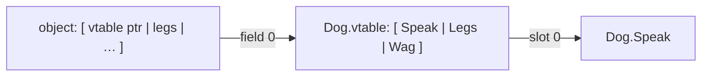
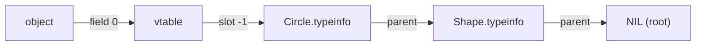

# Objects & Classes

Modula-2's record-and-pointer core is enough for most data structures, but NewM2 also
implements the **object-oriented layer** (ISO 10514-3 / ADW lineage): single-inheritance
**classes** with virtual methods, **abstract** classes, **interfaces** for COM, and — new —
**runtime type discrimination** via `ISMEMBER` and the `GUARD` statement. The whole layer is
*reference-based* and rides directly on the COM vtable ABI, so an M2 class can both model
your own hierarchy and consume a real OS COM object through the same machinery.

This page is grounded in `src/newm2-sema/src/class.rs` (the class model), `analyze.rs`
(checking), and `src/newm2-ir/src/lower.rs` + `src/newm2-runtime/src/rtti.rs` (layout +
RTTI).

## A class is a reference

A **class** is a record with methods, accessed only through a reference. An object variable
holds a *pointer* to a heap object; assignment copies the reference, not the object.

```modula2
CLASS Animal;
  VAR legs : INTEGER;
  PROCEDURE Speak () : INTEGER;
  BEGIN RETURN 0 END Speak;
END Animal;

VAR a, b : Animal;
BEGIN
  NEW(a);          (* allocate an Animal on the heap *)
  a.legs := 4;
  b := a;          (* b and a now reference the SAME object *)
  b.legs := 2;     (* a.legs is now 2 as well *)
```

Fields and methods are reached with `.`; a method's body sees the object as the implicit
`SELF`-like receiver (the fields are in scope unqualified). Classes are declared in an
`IMPLEMENTATION`/program module; a `DEFINITION MODULE` may carry the class's *interface*
(its public methods + fields), exactly mirroring the `.def`/`.mod` split for ordinary
modules — see [Modules & compilation](modules-and-compilation.md).

### Object layout

Every object begins with a hidden **vtable pointer** at field 0, followed by the inherited
fields then the class's own fields (`ClassSymbol.object_record`, `class.rs`). The vtable is
a per-class array of method pointers; calling `a.Speak()` loads field 0, indexes the method
slot, and calls it — so an overridden method dispatches on the object's *dynamic* class.



## Single inheritance

A class may `INHERIT` at most one base. The derived class gets all of the base's fields and
methods, and is a **subtype**: a `Dog` is assignable to an `Animal` variable (widening), but
not the reverse.

```modula2
CLASS Dog;
  INHERIT Animal;
  VAR tail : INTEGER;
  OVERRIDE PROCEDURE Speak () : INTEGER;   (* replace the inherited method *)
  BEGIN RETURN 2 END Speak;
  PROCEDURE Wag () : INTEGER;              (* a Dog-only method *)
  BEGIN RETURN tail END Wag;
END Dog;

VAR a : Animal; d : Dog;
BEGIN
  NEW(d);
  a := d;                 (* OK: Dog is-a Animal — the STATIC type is Animal,
                             the DYNAMIC type is Dog *)
  i := a.Speak();         (* dispatches to Dog.Speak -> 2 (dynamic dispatch) *)
```

`OVERRIDE` replaces an inherited method while keeping its slot, so dispatch through a base
reference reaches the most-derived implementation. A non-`OVERRIDE` method of the same name
is an error — overriding is explicit.

## Abstract classes

Prefix `ABSTRACT` to declare a class that cannot be instantiated, and `ABSTRACT` on a method
to declare it without a body — a placeholder a concrete subclass must implement.

```modula2
ABSTRACT CLASS Shape;
  ABSTRACT PROCEDURE Area () : INTEGER;    (* no body *)
END Shape;

CLASS Circle;
  INHERIT Shape;
  VAR r : INTEGER;
  OVERRIDE PROCEDURE Area () : INTEGER;
  BEGIN RETURN r * r * 3 END Area;
END Circle;
```

A concrete class that leaves an abstract method unimplemented is rejected
(`class.rs::validate`). You may declare *variables* of an abstract type (they hold concrete
subclass instances), but `NEW` on an abstract class is an error.

## Object lifetime

Objects are heap-allocated and reference-counted by you, not the language:

- **`NEW(obj)`** allocates the object and installs its vtable pointer at field 0.
- **`DISPOSE(obj)`** frees it.
- **`EMPTY`** is the null object reference — `EMPTY` is to objects as `NIL` is to pointers.
  A fresh object variable should be compared against `EMPTY`, and dereferencing an `EMPTY`
  reference faults.

```modula2
VAR s : Shape;
BEGIN
  NEW(s, Circle);          (* dynamic type Circle, static type Shape *)
  IF s # EMPTY THEN i := s.Area() END;
  DISPOSE(s);
```

See [Memory & exceptions](memory-and-exceptions.md) for the allocator and the
`--protect-heap` / `analyze` leak checks, which also cover object `NEW`/`DISPOSE`.

## Interfaces & COM

An **`INTERFACE`** is a vtable-only class — no fields, all methods abstract — whose slot
order *is* a COM interface's vtable. Annotated with its IID, it lets M2 call a real OS COM
object directly: assign the raw interface pointer to an interface variable and dispatch
through it.

```modula2
INTERFACE IMalloc ["00000002-0000-0000-c000-000000000046"];
  ABSTRACT PROCEDURE QueryInterface () : INTEGER;   (* slot 0 *)
  ABSTRACT PROCEDURE AddRef () : INTEGER;           (* slot 1 *)
  ABSTRACT PROCEDURE Release () : INTEGER;          (* slot 2 *)
  ABSTRACT PROCEDURE Alloc (cb : CARDINAL) : ADDRESS;
  ABSTRACT PROCEDURE Free (p : ADDRESS);
END IMalloc;
```

Because NewM2's object layout *is* the COM ABI, an object's field-0 vtable pointer and an OS
COM object's vtable are interchangeable: native method dispatch and COM method dispatch are
the same instruction. The compiler's `@N` slot annotations turn "the generator transcribed
the vtable" into "the build fails if a slot is off by one" — see
[`docs/design/com-interfaces.md`](../design/com-interfaces.md). An interface may also be
mirrored as an `ABSTRACT CLASS` (the historical idiom); both consume foreign COM objects.

## Runtime type discrimination — `ISMEMBER` and `GUARD`

A base-class reference hides the object's dynamic type. Two constructs recover it **safely**,
replacing the old hand-written "tag field + unchecked `CAST`" idiom.

### `ISMEMBER`

```modula2
ISMEMBER(p1, p2) : BOOLEAN
```

`ISMEMBER` is `TRUE` when `p1`'s class is `p2` or a subclass of it. Each operand is
independently a class **type name** or an object **value**:

| `p1` \\ `p2` | TYPE | VALUE |
|--------------|------|-------|
| **TYPE** | compile-time constant fold | runtime, vs the value's dynamic type |
| **VALUE** | the common case (vs a fixed type) | runtime, vs another value's dynamic type |

```modula2
IF ISMEMBER(a, Dog) THEN … END;     (* a's dynamic type is Dog or a Dog subclass *)
b := ISMEMBER(Dog, Animal);          (* folds to TRUE at compile time *)
```

A `NIL`/`EMPTY` object is a member of nothing, so `ISMEMBER(emptyVar, T)` is `FALSE`.

### `GUARD`

`GUARD` is `CASE` over dynamic type: it tests the selector against each arm in order and runs
the first that matches, **binding a read-only narrowed view** of the object in that arm.

```modula2
PROCEDURE Describe (x : Shape);
BEGIN
  GUARD x AS
    c : Circle  DO  i := c.r          (* c is a Circle here — full Circle access *)
  | s : Square  DO  i := s.side
  ELSE
    (* x is some other Shape *)
  END
END Describe;
```

Semantics (`analyse_guard` in `analyze.rs`, `lower_guard` in `lower.rs`):

- The selector is evaluated **once**.
- Arms are tested **top-to-bottom; first match wins** — put specific types before a
  base-class catch-all.
- The bound name (`c`, `s`) is a **read-only** narrowed view, scoped to that arm only;
  reading fields and calling methods through it needs no cast.
- A `NIL`/`EMPTY` selector takes the `ELSE`.
- With **no matching arm and no `ELSE`**, `GUARD` raises **`guardException`** — a NewM2
  exception with its own source (it is deliberately *not* one of the closed ISO
  `M2EXCEPTION` codes), catchable in an `EXCEPT` handler.
- `GUARD`, `AS`, and `ISMEMBER` are **soft keywords**: existing identifiers spelled `guard`
  / `as` / `ismember` keep working.

The arm types must be related to the selector's class (an unrelated arm is a compile error),
turning the old "the tag and the cast disagreed" runtime bug into a build failure.

### How it works — RTTI at `vtable[-1]`

Each native class emits a constant `{Class}.typeinfo` descriptor — `{ parent, name, depth }`
(`src/newm2-runtime/src/rtti.rs`) — for **every** class, abstract bases included, so the
ancestor chain is always complete. The pointer to it sits **one slot before** the object's
vtable (`vtable[-1]`), so ordinary method dispatch is byte-for-byte unchanged (and identical
for foreign COM objects, which simply have no such slot). `ISMEMBER`/`GUARD` read the
object's typeinfo and walk the parent chain (`nm2_rtti_isa`, with a `depth` early-out):



`nm2_rtti_isa(cand, target)` returns TRUE iff `target` is found while walking `cand`'s
`parent` chain — i.e. `cand` is `target` or a subclass.

## What's live, what's pending

- **Live:** classes, single inheritance, abstract classes + `OVERRIDE`, `NEW`/`DISPOSE`/
  `EMPTY`, virtual dispatch, `INTERFACE` consumption of foreign COM, and **native-class
  `ISMEMBER` + `GUARD`** (the design is `docs/design/guard-ismember.md`).
- **Pending:** `GUARD`/`ISMEMBER` on an **interface** (it needs a `QueryInterface` probe, not
  yet built) is rejected at compile time rather than silently misbehaving. Operator
  overloading and a universal root object are not provided (by design). `TRACED`
  (garbage-collected) classes are not implemented.

---
*See also [Declarations & types](declarations-and-types.md),
[Memory & exceptions](memory-and-exceptions.md), and the design note
[`docs/design/guard-ismember.md`](../design/guard-ismember.md).*
