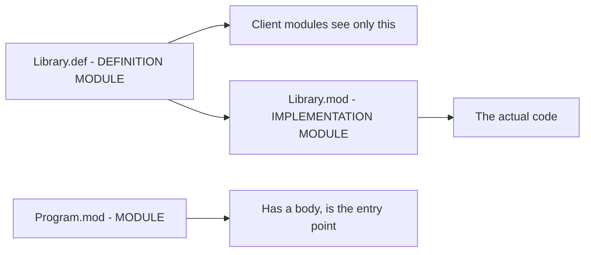

# Getting Started

How to build NewM2, run a Modula-2 program, and watch it move through the compiler.

## Prerequisites

- **Windows x86-64 / MSVC** — NewM2 targets `x86_64-pc-windows-msvc`.
- **Rust** (stable) — from [rustup.rs](https://rustup.rs).
- **LLVM 22.x** — configured in the workspace `.cargo/config.toml`.

## Build and run

```
cargo build --workspace
cargo run -p newm2-driver -- run Hello.mod
```

`run` JIT-compiles the module into a memory-resident image and executes it. Once the
driver is on `PATH` this shortens to `newm2 run Hello.mod`. For a standalone executable,
`newm2 build Hello.mod -o Hello.exe` emits a native PE/COFF `.exe`.

## The `.def` / `.mod` model

Modula-2 splits a library into two files that are compiled separately:



- A **program** is a `MODULE` (a `.mod` file) with a body — it is what you run.
- A **library** is a `DEFINITION MODULE` (`.def` — the public interface) plus an
  `IMPLEMENTATION MODULE` (`.mod` — the body). Clients import only what the `.def`
  exports. See [Modules & compilation](03-modules-and-compilation.md).

## Watching the pipeline

The driver stops after any phase, so you can inspect exactly what the compiler produced:

| Command | Shows |
|---------|-------|
| `newm2 dump-tokens f.mod` | the lexer's token stream |
| `newm2 dump-ast f.mod` | the parsed syntax tree |
| `newm2 dump-sema f.mod` | name/type resolution and the symbol table |
| `newm2 dump-ir f.mod` | the typed intermediate representation |
| `newm2 dump-llvm f.mod` | the generated LLVM IR |
| `newm2 dump-asm f.mod` | the emitted machine code |
| `newm2 run f.mod` | JIT-compile and execute |
| `newm2 build f.mod -o f.exe` | AOT-compile to a native `.exe` |
| `newm2 check f.mod` | parse + sema only |

## Memory: manual allocation

NewM2 uses **classical manual memory management**: `NEW` allocates via `HeapAlloc` and
`DISPOSE` frees via `HeapFree`. Every allocation must be paired with a `DISPOSE` before
the pointer goes out of scope. See [Memory & exceptions](10-memory-and-exceptions.md).

> NewM2's front-end (lexer, parser) accepts a broad swath of PIM 4 + ISO 10514-1; the
> back-end is younger, so some constructs parse before they run. Each page notes status
> where it matters.

---
[NewM2 Guide home](index.md) · [Lexical structure](02-lexical-structure.md) · [Modules & compilation](03-modules-and-compilation.md)
