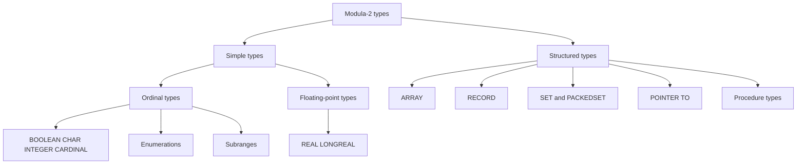

# Declarations & Types

How NewM2 names things: the three declaration sections, the built-in scalar types, and
the full range of structured types that Modula-2 lets you compose from them.

## The type taxonomy



Ordinal types have a total ordering and can be used as array indices, `CASE` selectors,
`SET` element types, and subrange hosts. Floating-point types are not ordinal.

## CONST, TYPE, VAR

A declaration block in a module body or procedure body may contain any combination of
`CONST`, `TYPE`, and `VAR` sections, in any order, repeated as many times as needed.
Each section ends when the next keyword (`CONST`, `TYPE`, `VAR`, `PROCEDURE`, `BEGIN`,
`END`) is encountered. This is intentional: you can open a new `CONST` after a `TYPE`
section if the constants depend on a type you just defined.

```modula2
CONST
  MaxItems = 256;
  Version  = "1.0";

TYPE
  Index    = [0..MaxItems-1];
  Table    = ARRAY Index OF INTEGER;

VAR
  count : INTEGER;
  data  : Table;
```

**Constant expressions.** The expression on the right-hand side of a `CONST` declaration
must be a compile-time constant: integer, real, character, or string literals, `TRUE`,
`FALSE`, `NIL`, a previously declared constant, or any arithmetic or relational
combination of those. `MAX`, `MIN`, `SIZE`, `ORD`, and `CHR` are also usable in constant
expressions. The corpus uses expressions like `Scale / 2` and `10000` freely (see
`library/advapidef/Money.def`).

**VarDecl address binding.** NewM2 also parses `VAR x [addr] : T;` — binding a variable
to a fixed memory address, a NewM2 extension (`src/newm2-parser/src/ast.rs`, `VarDecl`).
This is a low-level hardware-mapping facility; it parses but back-end support is limited.

## Built-in types (pervasive identifiers)

The type names below are *pervasive identifiers*, not reserved words — the lexer returns
them as ordinary `Ident` tokens and sema resolves them. This means you could (but
shouldn't) declare a local `INTEGER`. See [Lexical structure](02-lexical-structure.md) for
how the lexer/sema split works.

### PIM base types

| Type | Description |
|------|-------------|
| `INTEGER` | Signed machine-word integer (platform width) |
| `CARDINAL` | Unsigned machine-word integer; distinct from `INTEGER` |
| `REAL` | Single-precision floating-point |
| `LONGREAL` | Double-precision floating-point |
| `BOOLEAN` | `TRUE` or `FALSE`; ordinal |
| `CHAR` | A single character; ordinal |
| `BITSET` | `SET OF [0..WordBits-1]`; the predeclared set type |
| `PROC` | `PROCEDURE` with no parameters and no result (a callable value) |
| `LONGINT` | Long signed integer (wider than `INTEGER` on 32-bit targets) |
| `LONGCARD` | Long unsigned integer |

### Exact-width types

NewM2 registers these in sema (`src/newm2-sema/src/analyze.rs`, lines 401–408) and the
library uses them extensively:

| Type | Width / sign |
|------|-------------|
| `INTEGER8` `INTEGER16` `INTEGER32` `INTEGER64` | Exact-width signed |
| `CARDINAL8` `CARDINAL16` `CARDINAL32` `CARDINAL64` | Exact-width unsigned |
| `BYTE` `WORD` `DWORD` `QWORD` | Storage-unit aliases |
| `ACHAR` | ANSI/narrow character (8-bit) |
| `UCHAR` | Unicode/wide character (16-bit) |
| `ADDRESS` | Pointer-width unsigned (equivalent to `SYSTEM.ADDRESS`) |

These are pervasive identifiers; no import is needed. The `Money` module uses `INTEGER64`
for its currency type, and `Float.def` uses all three widths of `INTEGER` for rounding
conversion procedures.

### ISO 10514-1 numeric types

`COMPLEX` and `LONGCOMPLEX` are registered in the pervasive scope
(`src/newm2-sema/src/types.rs`, `Builtin::Complex` / `Builtin::LongComplex`). They parse
and type-check; full arithmetic lowering is a work in progress.

## Enumerations and subranges

**Enumerations** introduce a new ordinal type by listing its values in parentheses.
Ordinal values are 0, 1, 2, … in declaration order:

```modula2
TYPE
  Colour = (Red, Green, Blue);
  Direction = (North, East, South, West);
```

`ORD(Green)` is 1. `VAL(Colour, 2)` is `Blue`. Enumerations are their own nominal types:
`Colour` and `Direction` are not compatible even though both have four (or three)
elements. AST node: `TypeExpr::Enum` (`ast.rs`, line 203).

**Subranges** constrain an ordinal type to a contiguous range. The host type is inferred
from the bounds — integer literals give an `INTEGER` subrange, a character literal gives
a `CHAR` subrange, an enumeration constant gives an enumeration subrange:

```modula2
TYPE
  Digit    = [0..9];
  Letter   = ['A'..'Z'];
  PriColor = [Red..Blue];   (* subrange of Colour *)
```

Subranges are ordinal and can themselves be used as array indices or `SET` element types.
AST node: `TypeExpr::Subrange` (`ast.rs`, line 202). The corpus uses them for array index
types in the Win32 headers: `ARRAY [0..CCHCCTEXT-1] OF ACHAR` (`CUSTCNTL.def`).

## Arrays

**Fixed arrays** declare an index type (typically a subrange or named ordinal) and an
element type. The index may be a multi-dimensional list:

```modula2
TYPE
  Row    = ARRAY [0..7] OF INTEGER;
  Matrix = ARRAY [0..3], [0..3] OF REAL;
  Grid   = ARRAY Digit, Digit OF CHAR;
```

The AST holds a `Vec<TypeExpr>` for the index types and a single `Box<TypeExpr>` for the
base: `TypeExpr::Array(indices, base, span)` (`ast.rs`, line 207). A multi-dim array is
equivalent to an array of arrays; elements are accessed with comma-separated indices
`m[i, j]` or chained `m[i][j]`.

**Open arrays** appear only in formal parameter position. The syntax is `ARRAY OF T` with
no index bounds. The high bound is retrieved at runtime with `HIGH`:

```modula2
PROCEDURE Sum(a : ARRAY OF INTEGER) : INTEGER;
VAR i, s : INTEGER;
BEGIN
  s := 0;
  FOR i := 0 TO HIGH(a) DO
    s := s + a[i];
  END;
  RETURN s;
END Sum;
```

AST node: `TypeExpr::OpenArray(base, span)` (`ast.rs`, line 209). Sema enforces that
open arrays appear only in parameter position.

## Records and variants

A `RECORD` groups named fields of different types under one type name:

```modula2
TYPE
  Pair = RECORD
    left  : INTEGER;
    right : CARDINAL;
    mark  : CHAR;
  END;
```

This exact pattern appears in `Mod/tests/T40020RecordHelper.mod`. Records are value types
— `VAR p : Pair` allocates `Pair` inline on the stack; `POINTER TO Pair` puts it on the
heap.

**Variant records** extend a record with a `CASE` part, selecting which fields are
present based on a tag value:

```modula2
TYPE
  Shape =
    RECORD
      x, y : INTEGER;       (* fixed fields *)
      CASE kind : ShapeKind OF
        Circle   : radius : INTEGER; |
        Rect     : width, height : INTEGER; |
        Point    : (* no extra fields *)
      END;
    END;
```

The tag field (`kind`) is part of the record and holds the current variant. The `ELSE`
arm (`else_arm: Option<Vec<RecordField>>`) catches any tag value not listed explicitly.
Nested `CASE` within a variant arm is also parsed. A real corpus example appears in
`library/advapidef/DlgShell.def` (line 630): `CASE ct : ControlType OF PushButton: … | RadioGroup: …`.

AST nodes: `RecordType`, `VariantPart`, `VariantArm` (`ast.rs`, lines 221–253).

> **Note.** The variant record parses and sema resolves field references inside each arm.
> Generating correct LLVM IR for the overlapping-field layout is complete for simple
> variants; deeply nested variants are parsed but may not yet lower fully.

## Sets

`SET OF T` creates a set type over an ordinal base type. `BITSET` is the predeclared set
of `[0..WordBits-1]`. `PACKEDSET OF T` is the ISO 10514-1 compact variant:

```modula2
TYPE
  ExecFlags   = (ExecDetached, ExecMinimized, ExecMaximized, ExecHidden);
  ExecFlagSet = SET OF ExecFlags;
```

This appears verbatim in `library/advapidef/PipedExec.def`. Set variables support the
operators `+` (union), `-` (difference), `*` (intersection), `/` (symmetric difference),
`IN` (membership), `INCL`, and `EXCL`.

```modula2
VAR flags : ExecFlagSet;
BEGIN
  flags := ExecFlagSet{ExecMinimized, ExecHidden};
  INCL(flags, ExecDetached);
  IF ExecMinimized IN flags THEN … END;
END;
```

AST node: `TypeExpr::Set { packed, element, span }` (`ast.rs`, line 217). `Float.def`
demonstrates `PACKEDSET`: `FPExceptions = PACKEDSET OF FPException`.

## Pointers

`POINTER TO T` is a heap pointer. The value `NIL` is the null pointer and is compatible
with any pointer type. Dereferencing uses `^`:

```modula2
TYPE
  NodePtr = POINTER TO Node;
VAR
  p : NodePtr;
BEGIN
  NEW(p);          (* allocate a Node on the heap *)
  p^.value := 42;
  DISPOSE(p);      (* free it — HeapFree; p is set to NIL *)
END;
```

The `Mod/tests/t-40-010-new-record.mod` tests this pattern. Every `NEW` must be paired
with a `DISPOSE` before the pointer goes out of scope. See
[Memory & exceptions](10-memory-and-exceptions.md).

**Forward-declared pointer.** A pointer may refer to a record type not yet declared in
the same `TYPE` section. This is the only forward-reference allowed in Modula-2's `TYPE`
block:

```modula2
TYPE
  ListPtr = POINTER TO List;   (* List not yet visible — OK *)
  List    = RECORD
    value : INTEGER;
    next  : ListPtr;
  END;
```

AST node: `TypeExpr::Pointer(base, span)` (`ast.rs`, line 212). Sema defers resolution
of `Unresolved` pointer targets until the full `TYPE` section has been processed.

## Procedure types

A procedure type names the signature of a callable value — parameter modes and types,
optional return type. Variables of procedure type hold function pointers:

```modula2
TYPE
  Comparator   = PROCEDURE(INTEGER, INTEGER) : BOOLEAN;
  Transform    = PROCEDURE(VAR INTEGER);
  EnumCallBack = PROCEDURE(ARRAY OF CHAR);
```

`EnumCallBack` appears in `library/advapidef/ConfigSettings.def`. The Win32 bindings use
procedure types with calling-convention attributes like `[EXPORT]`
(`CUSTCNTL.def`, line 50: `LPFNCCSTYLEA = PROCEDURE(HWND, LPCCSTYLEA) : BOOL [EXPORT]`).

Procedure type variables are called like any other procedure:

```modula2
VAR cmp : Comparator;
BEGIN
  cmp := MyLessThan;
  IF cmp(a, b) THEN … END;
END;
```

AST node: `TypeExpr::Proc(ProcType)` where `ProcType` carries `params`, `return_ty`, and
optional `attrs` (`ast.rs`, lines 256–261).

## Opaque types

An opaque type is a `TYPE` name in a `DEFINITION MODULE` with no `=` body:

```modula2
DEFINITION MODULE PipedExec;
TYPE
  PipedExecHandle;         (* opaque — clients see only the name *)
```

Clients import and use `PipedExecHandle` values — they can pass them to procedures and
store them in variables — but cannot inspect or construct them. The structure lives
entirely in the `IMPLEMENTATION MODULE`. NewM2 represents this as `TypeDecl { def: None,
… }` (`ast.rs`, line 127: `/// None indicates an opaque type`).

See [Modules & compilation](03-modules-and-compilation.md) for how the definition and
implementation module pair interact.

---
[NewM2 Guide home](index.md) · [Lexical structure](02-lexical-structure.md) · [Expressions & operators](05-expressions-and-operators.md) · [Modules & compilation](03-modules-and-compilation.md)
