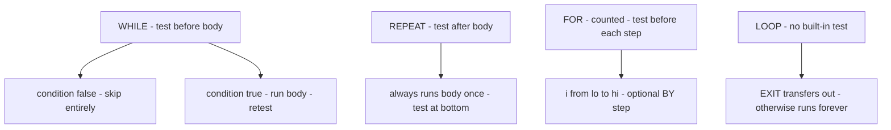

# Statements & Control Flow

Every action in a Modula-2 body is a statement. Statements are **separated** by `;` (not
terminated by it — a trailing `;` before `END` is legal because it introduces an empty
statement). This page covers the full statement set that NewM2 parses, grounded in the
`Stmt` enum in `src/newm2-parser/src/ast.rs`.

## Assignment and calls

**Assignment** (`Stmt::Assign`) uses `:=`; the left side is any designator (variable, field,
array element, or pointer dereference):

```modula2
i       := 0;
arr[k]  := arr[k] + 1;
p^.name := "hello";
```

**Procedure call** (`Stmt::Call`) is just a call expression used as a statement — no special
syntax. The expression must ultimately resolve to a call:

```modula2
STextIO.WriteLn;
SWholeIO.WriteInt(sum, 0);
INC(i);
```

The pervasive procedures `INC`, `DEC`, `INCL`, `EXCL` are identifiers (not keywords), so
they appear here as ordinary call statements that sema resolves.

Note: `=` is **equality** (expression context only); `:=` is assignment. The parser
(`Stmt::Assign`) rejects bare `=` in statement position, so this class of typo is caught
early.

## IF

`Stmt::If` holds a list of `(condition, body)` arms (covering both the `THEN` branch and
any `ELSIF` branches) plus an optional `else_arm`:

```modula2
PROCEDURE Category(n : INTEGER);
BEGIN
  IF n < 10 THEN
    STextIO.WriteString("low");
  ELSIF n < 100 THEN
    STextIO.WriteString("mid");
  ELSE
    STextIO.WriteString("high");
  END;
  STextIO.WriteLn;
END Category;
```

*(From `Mod/tests/t-20-030-if-else.mod`)*

`ELSIF` and `ELSE` are both optional; `ELSE` may appear at most once, after all `ELSIF`
arms. The whole construct closes with `END`.

## CASE

`Stmt::Case` matches an ordinal expression against a list of `CaseArm` values. Each arm is
a `CaseLabel` list — either `CaseLabel::Single` (a single value) or `CaseLabel::Range`
(an `a .. b` inclusive range). Arms are separated by `|`. An optional `ELSE` arm catches
everything not matched; without it, a value that matches no label is a run-time error.

```modula2
CASE RM OF
  rmNear:  RETURN NearestLong(X);
| rmDown:  RETURN FloorLong(X);
| rmUp:    RETURN CeilingLong(X);
| rmChop:  RETURN TruncLong(X);
END;
```

*(From `library/advapimod/Float.mod`, `ApplyRoundingMode`)*

Multiple labels on one arm and ranges on one arm:

```modula2
CASE code OF
  0, 1:      result := "ok";
| 10 .. 19:  result := "warning";
| 20 .. 99:  result := "error";
ELSE         result := "unknown";
END;
```

The scrutinee must be an ordinal type: `INTEGER`, `CARDINAL`, `CHAR`, `BOOLEAN`, or an
enumeration. `REAL` is not valid.

## Loops

Modula-2 has four loop forms. They differ in where the exit condition sits, and whether
iteration is counted.



### WHILE

`Stmt::While` tests the condition **before** each iteration. If the condition is false on
entry the body never runs:

```modula2
i := 1;
WHILE i <= 5 DO
  SWholeIO.WriteInt(i, 0);
  STextIO.WriteLn;
  i := i + 1;
END;
```

*(From `Mod/tests/t-20-010-while.mod`)*

### REPEAT

`Stmt::Repeat` tests the condition **after** the body, so the body always runs at least
once. The loop continues while the condition is `FALSE` and exits when it becomes `TRUE`:

```modula2
i := 0;
REPEAT
  SWholeIO.WriteInt(i, 0);
  STextIO.WriteLn;
  i := i + 1;
UNTIL i > 3;
```

*(From `Mod/tests/t-20-040-repeat.mod`, outputs 0, 1, 2, 3)*

### FOR

`Stmt::For` counts a control variable from `start` to `end` inclusive. The optional `BY`
clause (`step` field) defaults to 1. A negative step counts downward:

```modula2
(* Sum 1..10 = 55 *)
sum := 0;
FOR i := 1 TO 10 DO
  sum := sum + i;
END;
```

*(From `Mod/tests/t-20-020-for.mod`)*

```modula2
(* Iterate backwards — from library/win32mod/WinShell.mod *)
FOR i := 7 TO 0 BY -1 DO
  hexStr[i] := hexDig[num REM 16];
  num := num / 16;
END;
```

The control variable must be a local (or module-level) ordinal variable. Its value after
the loop is undefined by the standard; do not use it as if it were left at the last
executed value.

### LOOP and EXIT

`Stmt::Loop` introduces an unconditional loop with no built-in exit test. `Stmt::Exit`
transfers control to the statement after the nearest enclosing `LOOP … END`. This pair is
Modula-2's general loop construct — use it when the exit condition falls naturally in the
middle of the body:

```modula2
LOOP
  IF i < Elements THEN
    IF idNum <> Cache^[i]^.idNum THEN
      INC(i);
    ELSE
      (* found — promote to front, return *)
      RETURN TRUE;
    END;
  ELSE
    EXIT;   (* i >= Elements: not found *)
  END;
END;
RETURN FALSE;
```

*(From `library/win32mod/StringCache.mod`, `CacheHit`)*

`EXIT` is only meaningful inside a `LOOP` body; the parser accepts it anywhere in statement
position (`Stmt::Exit`), but semantics requires an enclosing `LOOP`.

## WITH

`Stmt::With` opens a record designator and makes its fields directly visible (unqualified)
within the `DO … END` body, just as if the fields were locally declared:

```modula2
WITH Dialogs[dlgNum] DO
  FOR i := 0 TO numCtrls - 1 DO
    IF ctrls^[i].id = index THEN
      RETURN i;
    END;
  END;
END;
```

*(From `library/advapimod/DlgShell.mod`, `GetControlSubscript` — `Dialogs[dlgNum]` is a
record, and `numCtrls`, `ctrls` are its fields)*

`WITH` reduces noise when accessing many fields of the same record. The designator is
evaluated once on entry; the binding is purely lexical (not a pointer copy). Nesting is
allowed; inner `WITH` fields shadow outer ones of the same name.

## RETURN

`Stmt::Return` holds an optional expression (`Option<Expr>`):

- In a **proper procedure** (no return type), `RETURN` with no expression exits early.
  Falling off the end is equivalent.
- In a **function procedure** (has a return type), `RETURN expr` carries the result. Every
  control path must reach a `RETURN expr`; the standard requires it, and sema will enforce
  this.

```modula2
(* Proper procedure — early exit *)
IF prc = NIL THEN
  RETURN;
END;

(* Function procedure *)
PROCEDURE SPLT(pos, w : INTEGER) : INTEGER;
BEGIN
  RETURN (pos - w DIV 2 + 1);
END SPLT;
```

*(Pattern from `library/win32mod/SplitterControl.mod`)*

## Statement table

| Statement | AST variant | Key keywords |
|-----------|-------------|--------------|
| Assignment | `Stmt::Assign` | `:=` |
| Procedure call | `Stmt::Call` | — |
| Empty | `Stmt::Empty` | bare `;` |
| Conditional | `Stmt::If` | `IF THEN ELSIF ELSE END` |
| Case select | `Stmt::Case` | `CASE OF \| ELSE END` |
| Pre-test loop | `Stmt::While` | `WHILE DO END` |
| Post-test loop | `Stmt::Repeat` | `REPEAT UNTIL` |
| Counted loop | `Stmt::For` | `FOR TO BY DO END` |
| Unconditional loop | `Stmt::Loop` | `LOOP END` |
| Loop exit | `Stmt::Exit` | `EXIT` |
| Record open | `Stmt::With` | `WITH DO END` |
| Return value | `Stmt::Return` | `RETURN` |
| Raise exception | `Stmt::Raise` | `RAISE` |
| Exception retry | `Stmt::Retry` | `RETRY` |
| Exception block | `Stmt::Block` | `EXCEPT FINALLY` |

The last three (`RAISE`, `RETRY`, `EXCEPT`/`FINALLY`) are ISO 10514-1 constructs — NewM2
parses them (`src/newm2-parser/src/ast.rs`, `Stmt::Raise`, `Stmt::Retry`, `Stmt::Block`)
but back-end execution is still being wired. See [Memory & exceptions](10-memory-and-exceptions.md).

---
[NewM2 Guide home](index.md) · [Expressions & operators](05-expressions-and-operators.md) · [Procedures](07-procedures.md)
