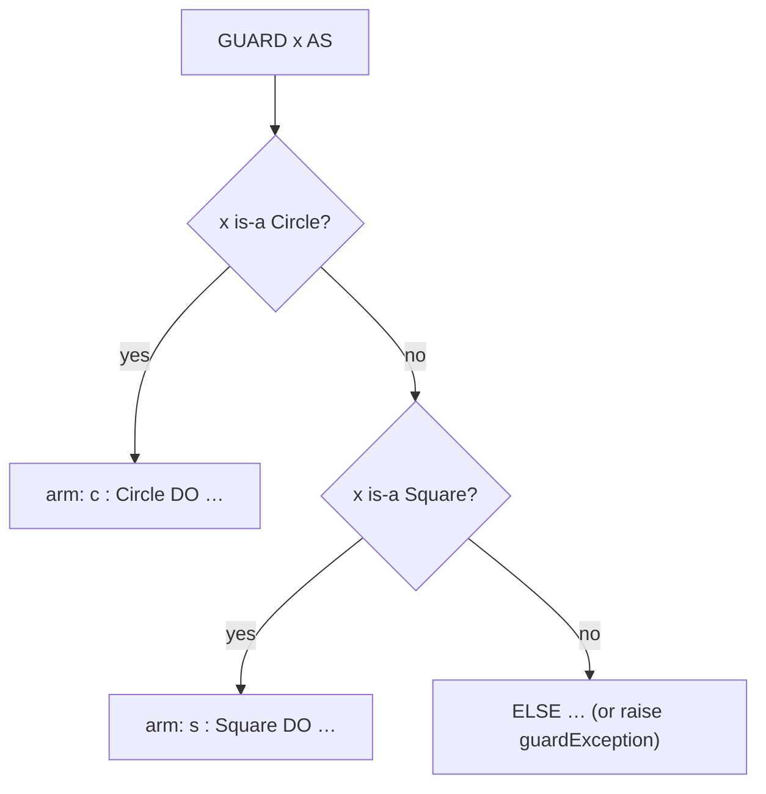

# Grammar & Syntax Summary

A compact EBNF of the language **as NewM2 parses it** (`src/newm2-parser/src/parser.rs`).
Notation: `[x]` optional, `{x}` zero-or-more, `a | b` alternatives, `"x"` a literal token.
This is a reading aid, not the normative grammar; see the chapter pages for semantics.

## Compilation units

A program is a `MODULE`; a library is a `DEFINITION` interface plus an `IMPLEMENTATION` body.

```ebnf
CompilationUnit = ProgramModule | DefinitionModule | ImplementationModule .

ProgramModule        = "MODULE" ident [ Priority ] ";" { Import } Block ident "." .
DefinitionModule     = "DEFINITION" "MODULE" ident ";" { Import } { Definition } "END" ident "." .
ImplementationModule = "IMPLEMENTATION" "MODULE" ident [ Priority ] ";" { Import } Block ident "." .

Import = [ "FROM" ident ] "IMPORT" identList ";" .
Block  = { Declaration } [ "BEGIN" StatementSeq ] [ Protection ] "END" .
```

## Declarations

```ebnf
Declaration = "CONST" { ConstDecl ";" }
            | "TYPE"  { TypeDecl ";" }
            | "VAR"   { VarDecl ";" }
            | ProcedureDecl ";"
            | ModuleDecl ";"
            | ClassDecl ";" .    (* see "Classes & interfaces" below *)

ConstDecl = ident "=" ConstExpr .
TypeDecl  = ident "=" Type .
VarDecl   = identList ":" Type .

ProcedureDecl = "PROCEDURE" ident [ FormalParams ] ";" Block ident
              | "PROCEDURE" ident [ FormalParams ] ";" "ASM" … "END" ident .   (* inline assembler *)

FormalParams = "(" [ FPSection { ";" FPSection } ] ")" [ ":" qualident ] .
FPSection    = [ "VAR" ] identList ":" FormalType .
```

## Types

```ebnf
Type = qualident
     | "ARRAY" Type { "," Type } "OF" Type
     | "RECORD" FieldList "END"
     | "SET" "OF" Type            | "PACKEDSET" "OF" Type
     | "POINTER" "TO" Type
     | "PROCEDURE" [ FormalTypeList ]
     | "(" identList ")"          (* enumeration *)
     | ConstExpr ".." ConstExpr   (* subrange *) .

FieldList = Field { ";" Field } [ "CASE" [ ident ":" ] qualident "OF" Variant { "|" Variant } "END" ] .
```

Built-in scalar types and the exact-width family are listed in
[Reference](11-reference.md).

## Expressions

```ebnf
Expr       = SimpleExpr [ Relation SimpleExpr ] .
Relation   = "=" | "#" | "<>" | "<" | "<=" | ">" | ">=" | "IN" .
SimpleExpr = [ "+" | "-" ] Term { ("+" | "-" | "OR") Term } .
Term       = Factor { ("*" | "/" | "DIV" | "MOD" | "REM" | "AND" | "&") Factor } .
Factor     = Designator [ ActualParams ]
           | Number | String | Set | "(" Expr ")" | ("NOT" | "~") Factor .
Designator = qualident { "." ident | "[" Expr { "," Expr } "]" | "^" } .
```

Bitwise word operators are NewM2 extensions: `BAND` `BOR` `BXOR` `BNOT` `SHL` `SHR`.

## Statements

```ebnf
StatementSeq = Statement { ";" Statement } .
Statement = [ Assignment | ProcCall
            | IfStmt | CaseStmt | GuardStmt
            | WhileStmt | RepeatStmt | ForStmt | LoopStmt | WithStmt
            | "EXIT" | "RETURN" [ Expr ] | "RAISE" [ Expr ] | "RETRY" ] .

Assignment = Designator ":=" Expr .
IfStmt   = "IF" Expr "THEN" StatementSeq { "ELSIF" Expr "THEN" StatementSeq } [ "ELSE" StatementSeq ] "END" .
CaseStmt = "CASE" Expr "OF" Case { "|" Case } [ "ELSE" StatementSeq ] "END" .
ForStmt  = "FOR" ident ":=" Expr "TO" Expr [ "BY" ConstExpr ] "DO" StatementSeq "END" .
LoopStmt = "LOOP" StatementSeq "END" .   (* leave with EXIT *)
```

A protected region uses ISO exception handling:

```ebnf
Protection = "EXCEPT" StatementSeq | "FINALLY" StatementSeq [ "EXCEPT" StatementSeq ] .
```

## Classes & interfaces (the COM-native object layer)

```ebnf
ClassDecl = [ "ABSTRACT" ] "CLASS" ident ";" [ "INHERIT" qualident ";" ]
              { ClassMember } "END" ident .
Interface = "INTERFACE" ident [ "[" iidString "]" ] ";" [ "INHERIT" qualident ";" ]
              { "ABSTRACT" MethodHeader ";" } "END" ident .

ClassMember = VarDecl ";"
            | [ "ABSTRACT" | "OVERRIDE" ] MethodHeader ";" [ MethodBody ] .
MethodHeader = "PROCEDURE" ident [ FormalParams ] .
```

`CLASS`, `INTERFACE`, `INHERIT`, `OVERRIDE`, `REVEAL`, `GUARD`, and `AS` are **contextual
(soft) keywords** — only `ABSTRACT` is reserved. See [Objects & classes](08-objects-and-classes.md).

### Runtime type discrimination

```ebnf
GuardStmt   = "GUARD" Expr "AS" GuardArm { "|" GuardArm } [ "ELSE" StatementSeq ] "END" .
GuardArm    = [ ident ":" ] qualident "DO" StatementSeq .

IsMemberCall = "ISMEMBER" "(" objectOrType "," objectOrType ")" .   (* : BOOLEAN *)
```



---
*Back to the [manual index](index.md). For semantics, follow the chapter links above.*
