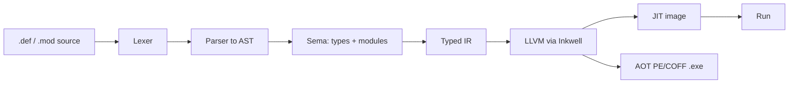
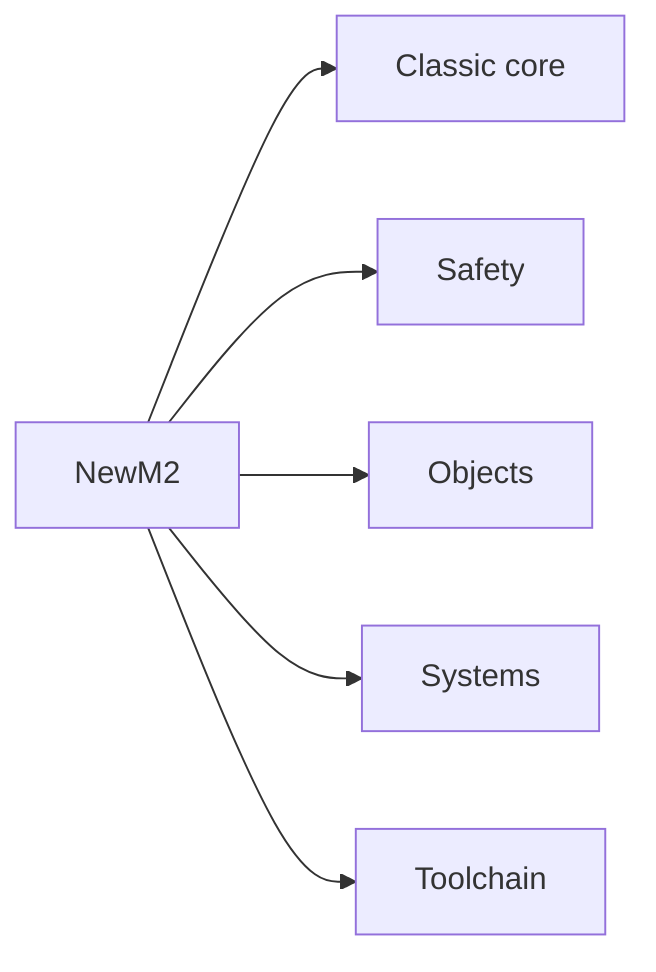

# NewModula-2 — User Guide & Programming Reference

*An offline manual for the NewM2 compiler: Niklaus Wirth's Modula-2 (PIM 4 + ISO
10514-1), reimagined on a modern **Rust + LLVM, JIT-first** architecture, with a
**COM-native object system** for Windows.*

---

## About this manual

This is a single, self-contained reference for the language **as NewM2 implements it** —
both a **user guide** (Part I, a guided tour from "hello world" to the object system) and a
**programming reference** (Part II, the systematic tables and grammar). Every construct is
grounded in the compiler source, and each page notes where something is *live* versus still
being wired.

NewM2 compiles a `.def`/`.mod` pair to a **memory-resident image you can run directly**
(`newm2 run Hello.mod`) or to a **native PE/COFF `.exe`** (`newm2 build Hello.mod -o Hello.exe`).

## NewM2 at a glance

Highlights of the current language:

- **Modules with separate interface and body** — `DEFINITION` + `IMPLEMENTATION`, compiled apart.
- **A COM-native object layer** — single-inheritance classes whose layout *is* the COM vtable
  ABI, `INTERFACE` types with IIDs, and **`GUARD` / `ISMEMBER`** for safe runtime type
  discrimination. NewM2 deliberately **departs from ISO 10514-3** here to fully support COM.
- **Deterministic memory** — manual `NEW`/`DISPOSE` plus a runtime heap guard and a static
  leak/`DISPOSE` analysis.
- **Real systems programming** — the `SYSTEM` module, inline assembler, and direct calls into
  Win32 / COM from M2.

---

## Part I — User Guide

| # | Chapter | What it covers |
|---|---------|----------------|
| 1 | [Getting started](01-getting-started.md) | Build, run, the `dump-*` driver, the `.def`/`.mod` model |
| 2 | [Lexical structure](02-lexical-structure.md) | Comments, identifiers, reserved words, literals, pragmas |
| 3 | [Modules & compilation](03-modules-and-compilation.md) | `DEFINITION`/`IMPLEMENTATION`, `IMPORT`/`EXPORT`, opaque types |
| 4 | [Declarations & types](04-declarations-and-types.md) | `CONST`/`TYPE`/`VAR`, the type system |
| 5 | [Expressions & operators](05-expressions-and-operators.md) | Arithmetic, `DIV`/`MOD`/`REM`, sets, precedence |
| 6 | [Statements & control flow](06-statements-and-control-flow.md) | `IF`, `CASE`, `WHILE`, `REPEAT`, `FOR`, `LOOP`, `WITH` |
| 7 | [Procedures](07-procedures.md) | Value/`VAR` parameters, function procedures, nesting, procedure types |
| 8 | [Objects & classes](08-objects-and-classes.md) | Classes, inheritance, abstract classes, interfaces/COM, `GUARD`/`ISMEMBER` |
| 9 | [The standard environment](09-standard-environment.md) | Pervasive procedures, the `SYSTEM` module, key libraries |
| 10 | [Memory & exceptions](10-memory-and-exceptions.md) | Pointers, `NEW`/`DISPOSE`, manual memory, `EXCEPT`/`FINALLY` |

## Part II — Programming Reference

| # | Chapter | What it covers |
|---|---------|----------------|
| 11 | [Reference](11-reference.md) | Reserved words, pervasive identifiers, the `SYSTEM` module, operators |
| 12 | [Grammar & syntax summary](12-grammar-summary.md) | The grammar at a glance — declarations, types, statements, classes |

---

## Conventions

- Code is Modula-2 (`.mod`/`.def`) unless noted; examples are small and runnable.
- A `src/newm2-…/…rs:NN` reference points into the NewM2 compiler source.
- Comments are `(* … *)` and nest. Statements are **separated** by `;`. Assignment is `:=`;
  equality is `=`. Reserved words and standard identifiers are UPPER CASE.
- Diagrams are Mermaid, rendered natively by DocCrate; this manual was produced offline with
  `doc-crate.exe --export-pdf`.
